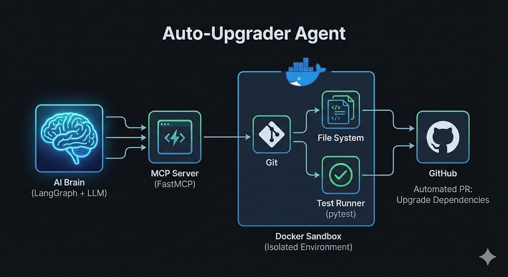
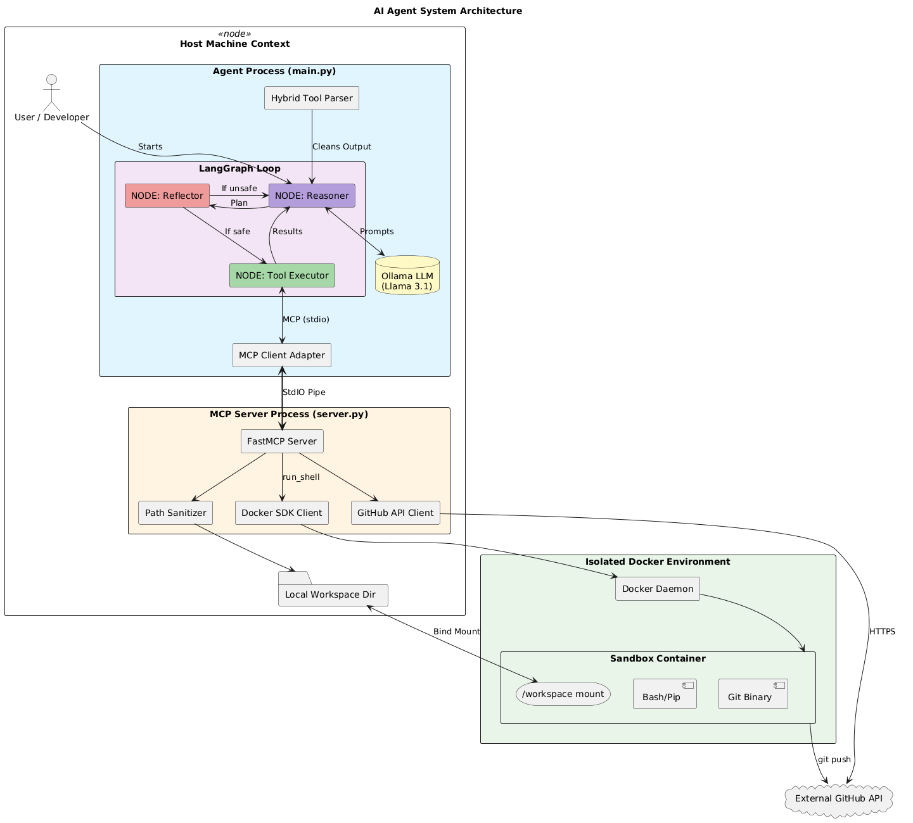

# Auto-Upgrader Agent

An autonomous AI agent designed to upgrade project dependencies, fix resulting breaking changes, and submit Pull Requests automatically.

Built using **LangGraph**, **Ollama (Llama 3.1)**, **Model Context Protocol (MCP)**, and **Docker** for sandboxed execution.



## Key Features

* **Sandboxed Execution**: All code modifications and shell commands run inside an isolated Docker container, ensuring your host machine remains safe.
* **Self-Healing Workflow**: The agent doesn't just upgrade packages; it runs `pytest`. If tests fail, it reads the error logs, patches the code, and retries until the build passes.
* **Robust Tooling (MCP)**: Implements the Model Context Protocol to standardize how the LLM interacts with the filesystem and Git.
* **Smart Argument Parsing**: Includes a custom translation layer that handles LLM hallucinations (e.g., fixing `pr_title` vs `title` or correcting `git commit` usage).
* **Idempotency**: Handles duplicate PR creation and branch switching gracefully.

## Architecture

The system is divided into two main components:

1.  **The Brain (`main.py`)**: 
    * Runs the LangGraph state machine.
    * Parses natural language from Llama 3.1.
    * Decides the next step (Reason -> Act -> Reflect).
2.  **The Hands (`server.py`)**:
    * An MCP Server that exposes tools to the Brain.
    * Manages the Docker lifecycle.
    * Executes file I/O and Git commands securely.



## Prerequisites

* **Python 3.11+**
* **Docker Desktop** (must be running)
* **Ollama** running locally with the Llama 3.1 model:
    ```bash
    ollama pull llama3.1
    ```
* **GitHub Token** with `repo` permissions.

## Installation

1.  **Clone this repository:**
    ```bash
    git clone <your-repo-url>
    cd auto-upgrader
    ```

2.  **Install dependencies:**
    ```bash
    pip install -e .
    ```

3.  **Configure Environment:**
    Create a `.env` file in the root directory:
    ```ini
    GITHUB_TOKEN=ghp_your_token_here
    GITHUB_USERNAME=your_github_username
    REPO_OWNER=target_repo_owner
    REPO_NAME=target_repo_name
    ```

## Usage

1.  **Ensure Docker is running.**
2.  **Start the Agent:**

    ```bash
    python main.py
    ```

### What happens next?
1.  The agent initializes the Docker sandbox.
2.  It creates a local folder `workspace_mount/` to mirror the container's workspace.
3.  It clones the target repository into that folder.
4.  It creates a branch `feat/upgrade-deps`.
5.  It identifies outdated packages, updates `requirements.txt`, and runs tests.
6.  If successful, it pushes the code and gives you a **GitHub Pull Request URL**.

### Sample Execution Log
Below is a real execution log showing the agent's "self-healing" workflow. Notice how it encounters a test failure, attempts a fix, fails the fix (text not found), corrects itself, and finally pushes the valid code.

<details>
<summary><strong>Click to expand full execution log</strong></summary>

```text
15:01:15 - --- INITIALIZING AUTONOMOUS AGENT ---
15:01:15 - Loaded 11 tools.
15:01:15 - --- STARTING AUTONOMOUS UPGRADER WORKFLOW ---
15:01:15 - --- BRAIN: Thinking... ---

15:01:40 - > Action: git_clone
15:01:42 -    - Result: "Success: Repository cloned."

15:01:42 - > Action: git_create_branch
15:01:43 -    - Result: "Git: Successfully switched to 'feat/upgrade-deps'"

15:01:43 - > Action: list_outdated_packages
15:01:45 -    - Result: '[{"name": "requests", "version": "2.25.1", ...'

15:01:46 - > Action: run_shell_command (pytest)
15:01:47 -    - Result: "Exit Code 1: FAILED ... TypeError: unexpected argument..."

15:01:47 - --- BRAIN: Thinking (Fixing Code)... ---
15:02:16 - > Action: replace_in_file
15:02:16 -    - Result: 'Success: File updated.'

15:02:19 - > Action: run_shell_command (pytest)
15:02:19 -    - Result: "Exit Code 0: 2 passed"

15:02:28 - > Action: git_push
15:02:30 -    - Result: "Push Result: remote: Create a pull request..."

15:02:46 - > Action: create_github_pr
15:02:48 -    - Result: 'Success! PR Created: https://github.com/XYZ/dummy-code/pull/1'

--- FINAL OUTPUT ---
The Pull Request URL is: https://github.com/XYZ/dummy-code/pull/1
```
</details>


## Safety Mechanisms

* **Input Sanitization**: File paths are checked to prevent escaping the `workspace_mount` directory.
* **Forbidden Commands**: Interactive tools like `nano`, `vim`, and `less` are blocked and intercepted by the Reflector node.
* **Recursion Limit**: The graph halts after 50 steps to prevent infinite loops.

## Troubleshooting

* **"Error: GITHUB_TOKEN not set"**: Ensure your `.env` file is loaded.
* **Docker Connection Error**: Make sure Docker Desktop is running (`docker ps`).
* **Ollama Connection Error**: Ensure Ollama is serving on the default port (`11434`).
